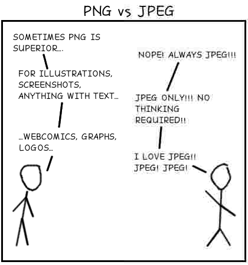

# JPEG without Discrete Cosine Transform

I’m exploring some ideas about data compression.

The JPEG compression algorithm inspired this project.
There’s one step in particular I’d like to change in JPEG.
_After_ splitting the colors into separate channels and _before_ quantizing the results, the algorithm _transforms_ the data.
It breaks the data into squares of 64 pixels each, then uses a Discrete Cosine Transform on each of groups.
The result is still a list a 64 numbers.
The idea is that the new list will be easier to quantize and compress.
DCT gives you a good guess at which numbers are most and least important, which in important in _lossy_ compression, a.k.a quantizing.
After quantizing, the data will go to an entropy encoder for lossless compression.
If a transform makes the quantized data more predictable, then the entropy encoder will do a good job.

My hypothesis is that there is nothing special about the DCT in this algorithm.
In some cases DCT can be very helpful.
But is DCT relevant to the JPEG algorithm?
It seems like a lot of other transforms will do the job, and some might work better than DCT.

I’m focused on linear transforms.
These are easy to specify and apply.
And they are powerful.
And, if I see promising results, this will be a perfect opportunity for the computer to tune things further on its own.
The AI doesn’t have to write code, just tune a matrix.

## For My Non-Technical Friends

- JPEG is a format for saving images on a computer.
- It is especially appropriate for photographs.
- JPEG allows you to make smaller files if you are willing to accept a lower quality image.
  - I.e. It gives you some choices when you save a file.
- I am taking a lot of inspiration from JPEG, but I’m changing a few details, to see if I can make a _better_ image format.
- _Better_ means:
  - Making smaller files while retaining higher quality.
  - Giving people better options when they save an image.
  - Working well on more types of images.

This cartoon shows one of the common problems in JPEG:

On the right side of the cartoon the quality is low and the text is hard to read.
Let me zoom in so you don’t have to squint.

This type of problem is called a “_JPEG artifact_.”

I love the term “_JPEG artifact_.”
“_Artifact_” literally means something man made.
If you’re exploring ancient runes, you _want_ to find _artifacts_.
But I’m trying to reproduce an image as accurately as possible.
In this context “_artifact_” is a bad word.
I want to create as few changes as possible in the pictures.
I want my _artifacts_ to be small and hard to find.
I don’t want to leave any evidence that I touched the file at all.

## The Algorithm

- Start with an uncompressed image as input.
- Split the image into 3 separate color planes
  - I will focus on a black and white image for now.
- Split the color plane into 8x8 squares.
  - There’s nothing specials about that size or shape.
  - I am currently investigating some alternatives.
- Apply a transformation to the each square.
  - JPEG uses a discrete cosine transform.
  - This is where I’m _seriously_ deviating from the JPEG algorithm.
  - I’m trying a variety of linear transforms.
- Quantize each result
  - I.e. Decide how much precision to use when saving the result.
  - And where to use more precision and where it’s safe to approximate more.
- Entropy encode that result
  - One last layer of compression.
  - This is lossless compression.

## Recursion vs Grid

The JPEG algorithm splits each picture into a grid of 8⨉8 cells.
The bulk of the processing works on one cell at a time.
This provides very limited context.
Having access to more context can dramatically improve the compression ratio without hurting quality.

I considered allowing each cell to have access to nearby cells that had already been encoded / decoded.
This might come from a preprocessing step which can access the entire image.
The problem is that each cell is compressed and decompressed in a _lossy_ manner.
So each cell would accumulate the errors from previous cells.
The fidelity of each cell will go down as the cells move to the bottom and the right.

I’d like to get the benefit of more context, but I want to control the errors better.
A recursive model would be perfect here.
I can build a description of the image in a tree-like fashion.
Numbers near the top of the tree will apply to a lot of pixels, so I want to allocate a lot of bits and get this part right.
Lower levels of the tree will have a lot more numbers, but each one will apply to fewer pixels, so I can allocate fewer bits per number here.

This feeds the same quantizer and entropy encoder as with the grid approach.
Each row of the tree could be a different group.
(Or several adjacent rows could be put in the same group.)
Each of the values in each group should have similar properties and should be compressed together.

A recursive model will limit the maximum number of steps from the beginning of the process any pixel.
And I can tweak the process to limit the number of steps with _limited fidelity_.

The ideas behind these two examples both started as a linear transform on an 8⨉8 square of pixels.
Then I expanded them out to do the same thing (recursively) on an arbitrarily large image.
The recursive code is written much differently, but these operations are still linear transforms.

### Example: Big Pixels

This is a _simple_ recursive model.
This would be a great place to start.

- Start with a squarish image.
- Take the average value of each pixel in the image.
  - This will (probably) not be an integer.
  - Send this value to the next layer. (Quantizing and entropy encoding.)
  - Subtract the average pixel value from the value of each individual pixel.
- Now consider the next layer of the tree.
  - Split the resulting image into four-ish equal-ish pieces.
  - Recursively call this algorithm on the first three pieces.
- Process the fourth piece in almost the same way.
  - There is no need to _explicitly_ write the average value of this piece.
  - The decoder can compute this value from the average of the other three pieces and the average of all pieces.
  - But do the recursive part the same was as always.
- Base case: A piece has only one pixel and cannot be broken into smaller pieces.

I should reorder that output a little.
I should send it out breath first, so I can do _progressive_ decoding.
I.e. if you’ve only downloaded the first part of the image, you can still see a low resolution version of the image.
The instructions above are depth first because that was easier to describe in English.

I will group the outputs by how many levels of recursion I’ve done.
The number at the top will be between 0 and 255, but it still may need more than 8 bits to store enough detail.
Values closer to the bottom will hopefully require fewer bits, even before I start to compromise the quality.

### Example: Nearby Pixels

Another recursive approach would be to focus on the values of certain pixels, but jump around the image to spread these pixels out. Start by recording the values of the 4 pixels on the edges of the image. Then split the image into half. If the image is taller than it is wide, cut it into top and bottom halves. Otherwise cut it into left and right halves. Either way you’ve added two new points, each between two existing points.

In the simplest case you compare the new point to the _average_ of the other two points.
However, having two inputs instead of one can help with the compression.
Based on [my previous experiences](https://github.com/TradeIdeasPhilip/compress) I suspect that the extra information will be useful to the entropy encoder, but I’d have to do more research on this data to see how to proceed.

As in the previous example, I will group the data based on the number of levels of recursion.

### Next Steps

I will need to get started with good input data.
This is the same data I need for the 8⨉8 squares version.
At a bare minimum I need one good image to examine.
Ideally I’d have a lot of images, including some that would be ideal for JPEG but have never been JPEGed.

This algorithm will be easy to implement.
There’s no need for a prototype.
Just do it.

This will provide me with a lot of good data.
I need to plot the data for each level of the tree.
Show me the extremes.
Show me a histogram of the values.
This is what I will need to feed into the entropy & quantizer steps.

This seems like a great place to start work immediately.
This is simpler than my plan for the 8⨉8 version.
And this will output more useful data.
The 8⨉8 version will put all pixels into a single group.
This version will create a series of groups, each with data that’s been processed slightly differently.

## TODO

### Better Input Data

I need better input data.
The way I’m currently doing it, one pixel at a time, is great for unit testing, but it’s getting tedious.
I need to load and process real image files.
And I need an optional preprocessing step to see how that affects things.

I will focus on the black and white data for now.

### Quantization

I need to look at the quantization.
Right now I’m storing each number in a `double`, so I lose very little to round off error.
The whole point of quantization is to use a lot fewer bits — to push our precision _beyond_ its limits — while minimizing the damage.

I need to see how much damage quantization will do.
That’s the only way to see if this project makes sense at all.
It’s very possible that the transformed data will cost _more_ bits than the original data just to get decent quality.
It’s also very possible that I’ll see good results from the start.
I won’t know until I add this step and look at the results.

I need to make sure I’m not giving more bits to the quantizer than it needs.

#### Starting Point

For simplicity, start with the identity transform.
All pixels are treated the same and are all grouped together.

**Assumption**:
When I look at all of the pixel values in the entire image, I expect some values to be much more common than other values.
I.e. if I pass the list of pixel values to an entropy encoder, I’d expect to see appreciable compression.
One transform will be considered _better_ than another if the resulting values would compress better.

I am designing and optimizing this algorithm for the case when this is true.
However, the algorithm should still give _decent_ results when the data is not compressible.
(E.g. All values are equally common or almost equal, or some value _are_ more common but storing a dictionary would be impractical.)
And the algorithm should degrade gracefully when the data is okay but not great.

Note my concern about the size of the dictionary.
A _good_ transform will spit out data that is easy to put in a dictionary.

**Case 1**:
Every value is (approximately) just as common as every other value.

I can still use quantization to get lossy compression.
I can use N values instead of 256.
(Lower N = Smaller file and worse quality.)
And the entropy encoder is useful when N is not an exact power of 2.

**Case 2**:
Values do _not_ span then entire possible range from 0 to 255.
Values between 30 and 200 each appear approximately as often as each other and the remaining values never appear.

First I check if quantization is required.
Maybe the compression settings say to use only 200 unique values, when this case actually needs only 171.

Then I create a _simple_ dictionary telling the entropy encoder the probabilities of each value.
In this case: “Values between 30 and 200 each appear approximately as often as each other and the remaining values never appear.”

**Case 3**:
When I plot a histogram of how how often each value appears, I get a bell curve.
This is an idealized case of what I’m optimizing for.

First consider the case where quantization is not required.
The main program allows this step to save all 256 possible values.
The entropy encoder will compress this well.
The taller and thinner the bell curve, the better the compression.

Now, what if the main program only allows 128 possible values?
I could just divide each value by 2.
But I could do better if I allocated more values near the peak of the bell curve and fewer values near the edges.
I never want to allocate more values than required in the middle.
Hopefully the _same_ dictionary can describe the frequency of each value _and_ how these values are spread out.

**Case 4**:

The histogram might include a few spikes spread out over over the values.
This would be common if someone draws on top of an image with a solid color.
E.g. text and arrows.

This might deserve special attention.
This is an important test case.

**Case 5**:

The histogram might include several different bell curves added together along with some random noise.
(I.e. multi-modal.)
This seems very common, as a photograph will have different areas. It will have dark areas, and light areas. None of these are a single color, but a set of similar colors.

This is what I expect from most photographs.
Some colors will be much more common than others.
The common colors will clump in groups next to each other.
I will have to make arbitrary cutoffs because these groups won’t be perfect or have clean edges.

### Measuring Error

I need an algorithm for objectively measuring the error of each compressed and decompressed file.

Eventually I will need more than one measure.
As discussed above, we will have different needs at different times.
For now I need something simple so I can start measuring the things I’m testing.

A very simple measure would compare each pixel in the final image to the same pixel in the original image.
Root - mean - square to get a total error.

This next algorithm is a little more forgiving.
We know this is lossy compression and we know that there will be round off errors even if the quality is set to the maximum.
So we need to prioritize _something_ to test this whole idea.
I want to allow some deviations in the low frequency parts and prioritize the smaller details.
If you take a picture of a document, and some parts are in shadow, your brain can filter that out.
This algorithm cares more about the relative values of nearby pixels, rather than the actual values of the pixels.
It limits the drift, too, so it never gets that far off.

- Compare _each_ pixel to _each_ of its 8 neighbors.

  - Start by comparing each pixel in the final image to its neighbor in the final image. (i.e. Compute the first derivative or the first difference.)
  - Then do the same thing to the corresponding pixels in the original image.
  - Then, for each of the 8 directions, compare the values we computed in the previous two bullet points.
  - A lot of these differences will be negative, so square the values at this step.
  - Compute the total over all pixels and all 8 directions, and take the square root of the total.
  - Divide the error by the total number of pixels so we can compare the results of different images.

- There are some special cases
  - What happens at the top and left of the image, when there is no adjacent pixel?
  - What happens at the bottom and the right of each cell when the decoder does not have access to the next pixel?
  - In both cases we use the same simple rule.
  - We look at the pixel in the middle and ignore the missing neighbor.
  - We compare the pixel in the final image directly to the same pixel in the original image.
  - That value might get repeated if this pixel is a corner piece.
  - This keeps our estimates from drifting too far from reality.
  - Initially these special cases have the same weight as the errors from the previous section.
  - However, we can adjust those weights to care more or less about long term drift.

There are no limits to what an error function can do.
We are already set up to transform cells of an image.
For example, we could do a DCT on the initial image and the final image before comparing them.
Then this error function could give higher weights to the errors in the low frequency items.
This is the data that standard JPEG thinks is the most important.
We could cover a lot with this framework, just using different transformation matrices and weights.

I’m rethinking my initial algorithm.

- We don’t need access to the nearby blocks.
- We can get the same general results with just a single transformation matrix.
- Each pixel in the transformed matrix is the sum of the pixel just to the right, the pixel one down, and the pixel one down and one right minus 3 times the pixel itself.
- In the bottom right corner we just use the value itself.
- On the right edge above the bottom:???❓ Ideally a mix of the corner and middle cases.
- ⁇ On the right edge include twice the value of the main pixel - the value of the pixel below it. Check that the signs are consistent between this and the other rules.
- We would not be able to square the individual error components with as much detail as in the original algorithm.
- So some positive errors could be masked by some negative errors.
- Is that a problem?
- Or maybe our standard algorithm should have the option to square or abs() each value before applying weights.
- Do we need to worry about how to weight the corner vs the edges vs interior?

## What I got so far

I have a nice framework for doing and reversing the transform step.
And I have some low level tools for inspecting that step.

The idea is straight from a linear algebra text book, but it’s good to see it actually working.

# Misc / Unsorted

We do not want a matrix that could do everything. It will have trouble doing anything well. Think about the case of the JPEG where we could choose photo mode or text mode. That’s great when we want to choose which channels to clip. But I’m hoping for cases where the computer can automatically notice that some data is very easy to predict in the entropy encoder. The computer might pick or even create a good matrix for the data.
